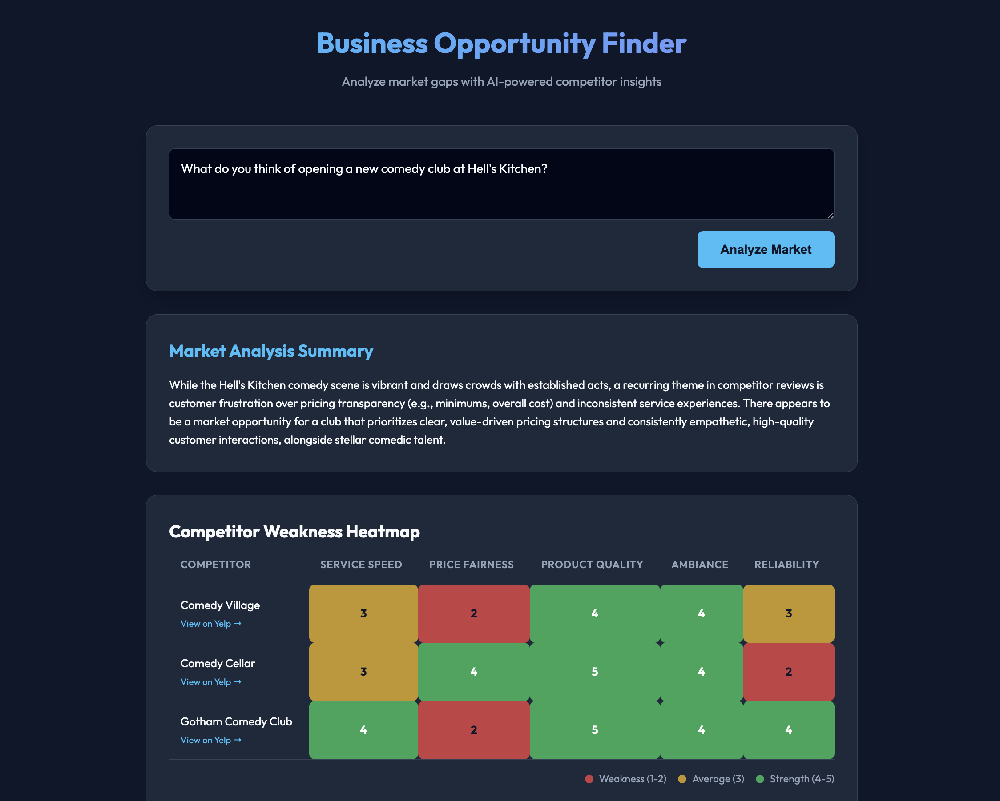

# Business Opportunity Finder 🚀

An AI-powered market analysis tool that helps entrepreneurs identify business opportunities by analyzing local competitors, customer reviews, and market gaps using advanced AI.



## ✨ Key Features

### 🎯 Market Gap Analysis
Uses Google Gemini 2.5 Flash to analyze competitor data from Yelp and identify underserved market needs with strategic insights.

### 📊 Competitor Weakness Heatmap
Interactive visualization of competitor strengths and weaknesses across five key criteria:
- **Service Speed** - Efficiency of service delivery
- **Price Fairness** - Value for money
- **Product Quality** - Quality of products/services
- **Ambiance** - Atmosphere and comfort
- **Reliability** - Consistency of experience

Scores are color-coded (red = weakness, yellow = average, green = strength) to quickly identify market gaps.

### 👥 Customer Personas
Automatically generates detailed customer personas based on actual customer reviews:
- Demographic characteristics and lifestyle
- Goals and motivations
- Pain points with direct quote evidence from reviews
- Preferences and desires
- Distinct segments representing different customer types

### 💬 Customer Reviews Analysis
Aggregates and analyzes real customer reviews from Yelp to extract:
- Common complaints and themes
- Service quality patterns
- Pricing sentiment
- Product quality feedback
- Ambiance and atmosphere insights

### 🧠 Business Gap Analyzer
**NEW**: Ask follow-up questions about your market analysis and receive strategic consulting-style answers:

**Consulting-Style Structured Responses:**
- 💡 **Main Insight** - Key strategic recommendation
- 🎯 **Key Moves** - 3 actionable steps to execute
- ⚠️ **Risks to Avoid** - Critical pitfalls to watch for

Asks contextually relevant questions based on your analysis (personas, market gaps, pricing opportunities).

### 🎨 Modern UI/UX
- **Collapsible Sections** - Clean, scannable interface with toggle controls
- **Smart Defaults** - Most important info (Market Summary) open by default
- **Dark Mode Design** - Professional, easy-on-the-eyes interface
- **Responsive Layout** - Works on all screen sizes
- **Smooth Animations** - Polished micro-interactions

---

## 🛠️ Tech Stack

- **Frontend**: Vanilla HTML, CSS (Custom Design System with CSS Variables), JavaScript
- **Backend**: Node.js, Express
- **AI/ML**: 
  - Google Gemini 2.5 Flash API (Market Analysis, Persona Generation, Business Gap Analyzer)
  - Yelp Fusion API + Yelp AI Chat (Business Data & Reviews)
- **Deployment**: Google Cloud Run ready (Firebase Hosting for frontend)

---

## 🚀 Getting Started

### Prerequisites

- Node.js (v18 or higher)
- npm
- **Yelp Fusion API Key** ([Get one here](https://www.yelp.com/developers))
- **Google Gemini API Key** ([Get one here](https://aistudio.google.com/app/apikey))

### Installation

1. **Clone the repository**
   ```bash
   git clone <repository-url>
   cd biz-finder
   ```

2. **Install dependencies**
   ```bash
   npm install
   ```

3. **Configure Environment Variables**
   
   Create a `.env` file in the root directory:
   ```env
   PORT=3000
   YELP_API_KEY=your_yelp_api_key_here
   GEMINI_API_KEY=your_gemini_api_key_here
   ```

4. **Start the server**
   ```bash
   npm start
   ```

5. **Open the application**
   
   Visit `http://localhost:3000` in your browser.

---

## 💡 How to Use

### 1. Enter Your Business Question
Type a market question like:
- *"Would a high-speed coffee shop work in Williamsburg?"*
- *"Is there demand for a vegan bakery in Brooklyn?"*
- *"Can a premium barbershop succeed in Manhattan?"*

### 2. Analyze Market
Click **Analyze Market** and wait 10-15 seconds while the AI:
- Queries Yelp for relevant competitors
- Fetches customer reviews
- Analyzes market gaps
- Generates customer personas
- Creates weakness heatmap

### 3. Explore Results

**Market Analysis Summary** (open by default)
- Strategic overview of the market opportunity
- Key insights and recommendations

**Competitor Weakness Heatmap** (click to expand)
- Visual grid showing competitor scores
- Color-coded cells for quick pattern recognition
- Links to Yelp pages for each competitor

**Customer Personas** (click to expand)
- 2-3 distinct customer segments
- Demographics, goals, pain points, preferences
- Real quote evidence from reviews

**Customer Reviews** (click to expand)
- Organized by business
- Star ratings and user names
- Full review text with timestamps

**Business Gap Analyzer** (click to expand)
- Pre-filled contextual question
- Edit to ask your own follow-up questions
- Structured consulting-style answers:
  - 💡 Main Insight
  - 🎯 Key Moves (actionable steps)
  - ⚠️ Risks to Avoid

---

## 📂 Project Structure

```
biz-finder/
├── public/
│   ├── index.html          # Main frontend application
│   └── favicon.ico         # App icon
├── services/
│   ├── gemini.js           # Gemini AI integration (analysis, personas, Q&A)
│   └── yelp-ai-chat.js     # Yelp API integration (business data, reviews)
├── server.js               # Express server & API endpoints
├── package.json            # Dependencies
├── .env                    # Environment variables (not in repo)
└── README.md               # You are here!
```

---

## 🎯 API Endpoints

### `POST /analyze`
Analyzes market opportunity for a given query.

**Request:**
```json
{
  "query": "Would a coffee shop work in Brooklyn?"
}
```

**Response:**
```json
{
  "summary": "Market analysis summary...",
  "criteria": [...],
  "competitors": [...],
  "personas": [...],
  "reviews": {...},
  "yelp_insight": "...",
  "chat_id": "..."
}
```

### `POST /follow-up`
Answers follow-up questions with consulting-style structured responses.

**Request:**
```json
{
  "question": "How can I address customer pain points?",
  "context": {
    "query": "...",
    "summary": "...",
    "businesses": [...],
    "reviews": {...},
    "personas": [...]
  }
}
```

**Response:**
```json
{
  "answer": {
    "mainInsight": "Key strategic insight...",
    "keyMoves": [
      "First actionable step...",
      "Second actionable step...",
      "Third actionable step..."
    ],
    "risksToAvoid": [
      "First risk...",
      "Second risk..."
    ]
  }
}
```

---

## 🌟 Feature Highlights

### Intelligent Context Building
The Business Gap Analyzer passes comprehensive context to Gemini including:
- Original user query
- Market analysis summary
- Competitor details (names, ratings, reviews, pricing)
- Customer review excerpts (top 3 per business)
- Complete persona information (demographics, goals, pain points)

### Robust Response Parsing
Triple-layer fallback ensures structured responses are always displayed:
1. Parse strict JSON from Gemini
2. Extract structure from plain text with section headers
3. Smart paragraph splitting as last resort

### Smart Question Generation
Contextually relevant follow-up questions based on:
- Customer personas identified
- Market gaps mentioned in summary
- Pricing opportunities highlighted
- Default strategic questions for any market

---

## 🚢 Deployment

### Google Cloud Run
```bash
# Build and deploy
gcloud run deploy business-opportunity-finder \
  --source . \
  --platform managed \
  --region us-central1 \
  --allow-unauthenticated
```

### Firebase Hosting (Frontend Only)
```bash
firebase deploy --only hosting
```

---

## 🔑 Environment Variables

| Variable | Description | Required |
|----------|-------------|----------|
| `PORT` | Server port (default: 3000) | No |
| `YELP_API_KEY` | Yelp Fusion API key for business data | Yes |
| `GEMINI_API_KEY` | Google Gemini API key for AI analysis | Yes |

---

## 🎨 Design System

The app uses a carefully crafted design system with CSS variables:

```css
:root {
  --bg-color: #0f172a;           /* Dark blue background */
  --card-bg: #1e293b;            /* Card background */
  --text-primary: #f8fafc;       /* Primary text */
  --text-secondary: #94a3b8;     /* Secondary text */
  --accent: #38bdf8;             /* Bright cyan accent */
  --accent-hover: #0ea5e9;       /* Hover state */
  --danger: #ef4444;             /* Error/warning red */
  --warning: #eab308;            /* Warning yellow */
  --success: #22c55e;            /* Success green */
  --border: #334155;             /* Border color */
}
```

### Typography
- **Font Family**: [Outfit](https://fonts.google.com/specimen/Outfit) from Google Fonts
- **Weights**: 300 (Light), 400 (Regular), 600 (Semi-Bold), 700 (Bold)

---

## 🤝 Contributing

Contributions are welcome! Feel free to open issues or submit pull requests.

---

## 📄 License

MIT License

---

## 🙏 Acknowledgments

- **Yelp Fusion API** for competitor and review data
- **Google Gemini AI** for intelligent market analysis
- **Outfit Font** by Google Fonts
- Built with ❤️ for entrepreneurs and market researchers

---

## 📞 Support

For issues or questions:
- Open a GitHub issue
- Check the [walkthrough documentation](./walkthrough.md)

---

**Ready to discover your next business opportunity? 🚀**
